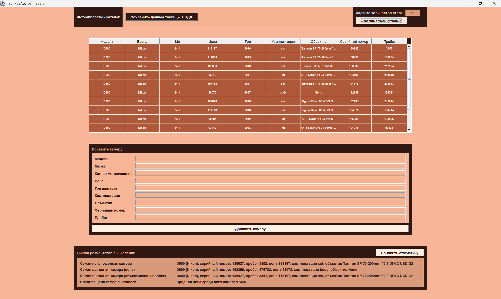

## Приложение - каталог фотоаппаратов

___
### Для работы программы необходимо:
- **openjdk-26**
- **Windows 10 (Windows 11)**
---



### External tool для заапуска проекта из cmd:


Arguments: 
```bash
/c "chcp 65001 > nul && cd /d $ProjectFileDir$ && 
C:\Users\Maini\.jdks\openjdk-26.0.1\bin\java.exe 
--enable-native-access=ALL-UNNAMED -Djansi.force=true 
-cp target\classes;%USERPROFILE%\.m2\repository\org\
fusesource\jansi\jansi\2.4.0\jansi-2.4.0.jar;%USERPROFILE%\
.m2\repository\com\itextpdf\itextpdf\5.5.13.4\itextpdf-5.5.13.4.jar ru.sablin.lab3.Main"
```